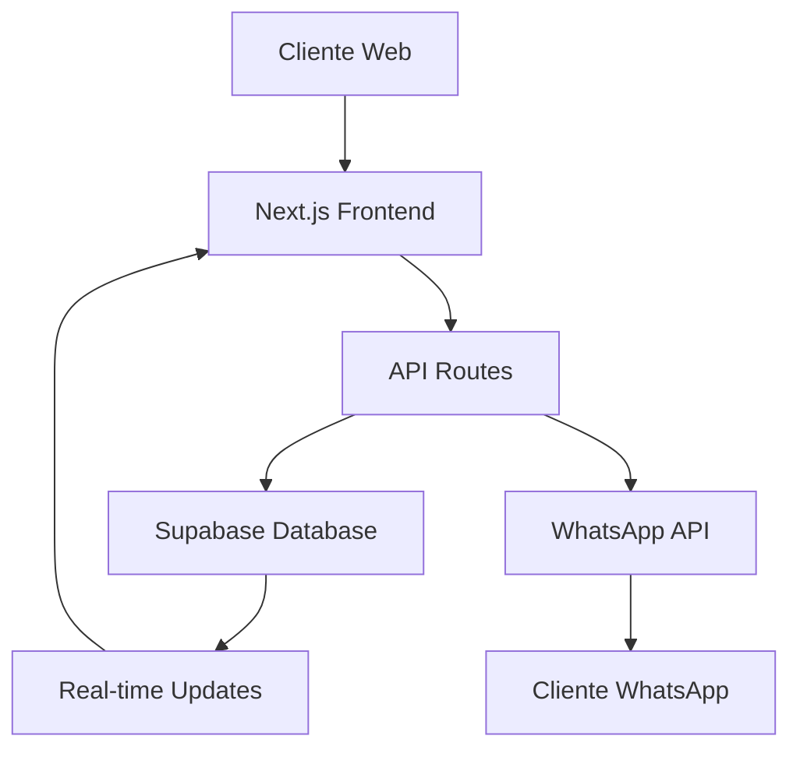

# 🏗️ Backend Architecture - Comida Casera El Seibo

## 📋 Tabla de Contenidos

1. [Arquitectura General](#arquitectura-general)
2. [Base de Datos Supabase](#base-de-datos-supabase)
3. [API Routes](#api-routes)
4. [Integración WhatsApp](#integración-whatsapp)
5. [Real-time Features](#real-time-features)
6. [Variables de Entorno](#variables-de-entorno)
7. [Deployment](#deployment)
8. [Monitoreo y Logs](#monitoreo-y-logs)

---

## 🏛️ Arquitectura General

### Stack Tecnológico
- **Frontend**: Next.js 14 con TypeScript
- **Backend**: Next.js API Routes
- **Base de Datos**: Supabase (PostgreSQL)
- **Real-time**: Supabase Realtime
- **Autenticación**: Supabase Auth (futuro)
- **Mensajería**: WhatsApp Business API
- **Hosting**: Vercel (recomendado)

### Flujo de Datos


---

## 🗄️ Base de Datos Supabase

### Esquema de Tablas

#### 1. `daily_menu` - Menú Diario
```sql
CREATE TABLE daily_menu (
  id UUID DEFAULT uuid_generate_v4() PRIMARY KEY,
  name VARCHAR(255) NOT NULL,
  description TEXT,
  price DECIMAL(10,2) NOT NULL,
  image_url TEXT,
  emoji VARCHAR(10),
  availability VARCHAR(20) DEFAULT 'available',
  available_portions INTEGER DEFAULT 0,
  date_added DATE DEFAULT CURRENT_DATE,
  is_active BOOLEAN DEFAULT true,
  created_at TIMESTAMP WITH TIME ZONE DEFAULT NOW(),
  updated_at TIMESTAMP WITH TIME ZONE DEFAULT NOW()
);
```

#### 2. `orders` - Órdenes
```sql
CREATE TABLE orders (
  id UUID DEFAULT uuid_generate_v4() PRIMARY KEY,
  order_number VARCHAR(20) UNIQUE NOT NULL,
  customer_name VARCHAR(255) NOT NULL,
  customer_phone VARCHAR(20) NOT NULL,
  customer_email VARCHAR(255),
  service_type VARCHAR(20) NOT NULL,
  delivery_address TEXT,
  special_instructions TEXT,
  total_amount DECIMAL(10,2) NOT NULL,
  status VARCHAR(20) DEFAULT 'submitted',
  whatsapp_thread_id VARCHAR(255),
  estimated_ready_time TIMESTAMP WITH TIME ZONE,
  actual_ready_time TIMESTAMP WITH TIME ZONE,
  created_at TIMESTAMP WITH TIME ZONE DEFAULT NOW(),
  updated_at TIMESTAMP WITH TIME ZONE DEFAULT NOW()
);
```

#### 3. `order_items` - Items de Órdenes
```sql
CREATE TABLE order_items (
  id UUID DEFAULT uuid_generate_v4() PRIMARY KEY,
  order_id UUID REFERENCES orders(id) ON DELETE CASCADE,
  menu_item_id UUID REFERENCES daily_menu(id),
  menu_item_name VARCHAR(255) NOT NULL,
  quantity INTEGER NOT NULL,
  unit_price DECIMAL(10,2) NOT NULL,
  total_price DECIMAL(10,2) NOT NULL,
  created_at TIMESTAMP WITH TIME ZONE DEFAULT NOW()
);
```

#### 4. `customer_profiles` - Perfiles de Clientes
```sql
CREATE TABLE customer_profiles (
  id UUID DEFAULT uuid_generate_v4() PRIMARY KEY,
  phone VARCHAR(20) UNIQUE NOT NULL,
  name VARCHAR(255) NOT NULL,
  email VARCHAR(255),
  delivery_address TEXT,
  preferred_service VARCHAR(20) DEFAULT 'pickup',
  total_orders INTEGER DEFAULT 0,
  favorite_items JSONB DEFAULT '[]',
  last_order_date DATE,
  created_at TIMESTAMP WITH TIME ZONE DEFAULT NOW(),
  updated_at TIMESTAMP WITH TIME ZONE DEFAULT NOW()
);
```

#### 5. `order_status_history` - Historial de Estados
```sql
CREATE TABLE order_status_history (
  id UUID DEFAULT uuid_generate_v4() PRIMARY KEY,
  order_id UUID REFERENCES orders(id) ON DELETE CASCADE,
  old_status VARCHAR(20),
  new_status VARCHAR(20) NOT NULL,
  changed_by VARCHAR(50) DEFAULT 'system',
  notes TEXT,
  created_at TIMESTAMP WITH TIME ZONE DEFAULT NOW()
);
```

#### 6. `whatsapp_messages` - Mensajes WhatsApp
```sql
CREATE TABLE whatsapp_messages (
  id UUID DEFAULT uuid_generate_v4() PRIMARY KEY,
  order_id UUID REFERENCES orders(id) ON DELETE SET NULL,
  message_type VARCHAR(50) NOT NULL,
  recipient_phone VARCHAR(20) NOT NULL,
  message_content TEXT NOT NULL,
  whatsapp_message_id VARCHAR(255),
  sent_at TIMESTAMP WITH TIME ZONE DEFAULT NOW(),
  delivered_at TIMESTAMP WITH TIME ZONE,
  read_at TIMESTAMP WITH TIME ZONE,
  created_at TIMESTAMP WITH TIME ZONE DEFAULT NOW()
);
```

### Funciones y Triggers

#### Auto-actualización de timestamps
```sql
CREATE OR REPLACE FUNCTION update_updated_at_column()
RETURNS TRIGGER AS $$
BEGIN
    NEW.updated_at = NOW();
    RETURN NEW;
END;
$$ language 'plpgsql';
```

#### Generación automática de números de orden
```sql
CREATE OR REPLACE FUNCTION generate_order_number()
RETURNS TEXT AS $$
DECLARE
    new_number TEXT;
    counter INTEGER;
BEGIN
    SELECT COUNT(*) + 1 INTO counter
    FROM orders 
    WHERE DATE(created_at) = CURRENT_DATE;
    
    new_number := 'ORD' || TO_CHAR(CURRENT_DATE, 'YYYYMMDD') || LPAD(counter::TEXT, 3, '0');
    RETURN new_number;
END;
$$ language 'plpgsql';
```

### Row Level Security (RLS)

```sql
-- Acceso público a menú activo
CREATE POLICY "Public read daily menu" ON daily_menu
  FOR SELECT TO anon, authenticated
  USING (is_active = true);

-- Cualquiera puede crear órdenes
CREATE POLICY "Anyone can create orders" ON orders
  FOR INSERT TO anon, authenticated
  WITH CHECK (true);

-- Lectura pública de órdenes por número
CREATE POLICY "Public read orders by order number" ON orders
  FOR SELECT TO anon, authenticated
  USING (true);
```

---

## 🛣️ API Routes

### 1. `/api/menu` - Gestión del Menú

#### GET - Obtener menú del día
```typescript
// Respuesta exitosa
{
  "success": true,
  "menuItems": [
    {
      "id": 1,
      "name": "Pollo Guisado con Vegetales",
      "description": "Pollo tierno guisado...",
      "price": 350,
      "emoji": "🍗",
      "availability": "available",
      "availablePortions": 15
    }
  ]
}
```

#### POST - Agregar item al menú (Admin)
```typescript
// Request body
{
  "name": "Nuevo Plato",
  "description": "Descripción del plato",
  "price": 300,
  "emoji": "🍽️",
  "availablePortions": 10
}
```

### 2. `/api/orders` - Gestión de Órdenes

#### POST - Crear nueva orden
```typescript
// Request body
{
  "customerName": "Juan Pérez",
  "customerPhone": "18091234567",
  "customerEmail": "juan@email.com",
  "serviceType": "delivery",
  "deliveryAddress": "Calle Principal #123",
  "items": [
    {
      "id": 1,
      "name": "Pollo Guisado",
      "price": 350,
      "quantity": 2
    }
  ],
  "totalAmount": 750,
  "specialInstructions": "Sin cebolla"
}

// Respuesta exitosa
{
  "success": true,
  "order": {
    "id": "uuid",
    "orderNumber": "ORD20241201001",
    "status": "submitted",
    "estimatedTime": 45
  }
}
```

#### GET - Obtener estado de orden
```typescript
// Query: /api/orders?id=uuid
{
  "success": true,
  "order": {
    "id": "uuid",
    "orderNumber": "ORD20241201001",
    "status": "preparing",
    "estimatedTime": 25,
    "customerName": "Juan Pérez",
    "items": [...],
    "totalAmount": 750
  }
}
```

### 3. `/api/customers` - Gestión de Clientes

#### GET - Obtener perfil de cliente
```typescript
// Query: /api/customers?phone=18091234567
{
  "success": true,
  "customer": {
    "phone": "18091234567",
    "name": "Juan Pérez",
    "email": "juan@email.com",
    "deliveryAddress": "Calle Principal #123",
    "preferredService": "delivery",
    "totalOrders": 5,
    "favoriteItems": [...]
  }
}
```

### 4. `/api/admin/orders` - Panel de Administración

#### GET - Obtener órdenes (Admin)
```typescript
// Query: /api/admin/orders?status=preparing&date=2024-12-01
{
  "success": true,
  "orders": [...],
  "summary": {
    "totalOrders": 25,
    "totalRevenue": 8750,
    "statusCounts": {
      "submitted": 3,
      "confirmed": 5,
      "preparing": 8,
      "ready": 4,
      "completed": 5
    }
  }
}
```

#### PUT - Actualizar estado de orden (Admin)
```typescript
// Request body
{
  "orderId": "uuid",
  "status": "ready",
  "notes": "Orden lista para entrega"
}
```

### 5. `/api/whatsapp/webhook` - Webhook WhatsApp

#### GET - Verificación de webhook
```typescript
// Query params: hub.mode, hub.verify_token, hub.challenge
// Respuesta: challenge string
```

#### POST - Procesar mensajes entrantes
```typescript
// Webhook payload de WhatsApp
{
  "object": "whatsapp_business_account",
  "entry": [
    {
      "changes": [
        {
          "field": "messages",
          "value": {
            "messages": [
              {
                "from": "18091234567",
                "text": {
                  "body": "menú"
                },
                "type": "text"
              }
            ]
          }
        }
      ]
    }
  ]
}
```

---

## 📱 Integración WhatsApp

### Configuración WhatsApp Business API

#### Variables requeridas:
```env
WHATSAPP_ACCESS_TOKEN=your_access_token
WHATSAPP_PHONE_NUMBER_ID=your_phone_number_id
WHATSAPP_VERIFY_TOKEN=your_verify_token
WHATSAPP_BUSINESS_ACCOUNT_ID=your_business_account_id
```

### Funcionalidades Implementadas

#### 1. Respuestas Automáticas
- **"menú"** → Envía menú del día completo
- **"orden"** → Instrucciones para consultar estado
- **Mensaje general** → Mensaje de bienvenida

#### 2. Notificaciones de Estado
- Confirmación de orden
- Estado "preparando"
- Orden lista
- Orden en camino (delivery)
- Orden completada

#### 3. Formato de Mensajes
```typescript
// Ejemplo: Menú del día
const menuMessage = `🍽️ *MENÚ DE HOY - Comida Casera El Seibo*

🍗 *Pollo Guisado con Vegetales*
   Pollo tierno guisado con zanahoria, papa...
   💰 RD$ 350

🥩 *Carne Guisada con Yuca*
   Carne de res tierna guisada...
   💰 RD$ 380

📱 Para hacer tu pedido, visita: ${process.env.NEXT_PUBLIC_APP_URL}

🚚 Servicio a domicilio: RD$ 50
📍 Recogida en tienda: Gratis`
```

---

## ⚡ Real-time Features

### Supabase Realtime

#### 1. Suscripción a actualizaciones de órdenes
```typescript
import { subscribeToOrderUpdates } from '@/lib/realtime'

const subscription = subscribeToOrderUpdates(orderId, (payload) => {
  console.log('Order updated:', payload)
  // Actualizar UI
})

// Cleanup
subscription.unsubscribe()
```

#### 2. Suscripción a cambios del menú
```typescript
import { subscribeToMenuUpdates } from '@/lib/realtime'

const subscription = subscribeToMenuUpdates((payload) => {
  console.log('Menu updated:', payload)
  // Recargar menú
})
```

#### 3. Historial de estados en tiempo real
```typescript
import { subscribeToOrderStatusHistory } from '@/lib/realtime'

const subscription = subscribeToOrderStatusHistory(orderId, (payload) => {
  console.log('Status history updated:', payload)
  // Mostrar nueva entrada en timeline
})
```

---

## 🔧 Variables de Entorno

### Archivo `.env.local`

```env
# ===========================================
# SUPABASE CONFIGURATION
# ===========================================
NEXT_PUBLIC_SUPABASE_URL=https://your-project.supabase.co
NEXT_PUBLIC_SUPABASE_ANON_KEY=your_anon_key
SUPABASE_SERVICE_ROLE_KEY=your_service_role_key
SUPABASE_PROJECT_ID=your_project_id

# ===========================================
# WHATSAPP BUSINESS API
# ===========================================
WHATSAPP_ACCESS_TOKEN=your_access_token
WHATSAPP_PHONE_NUMBER_ID=your_phone_number_id
WHATSAPP_VERIFY_TOKEN=your_verify_token
WHATSAPP_BUSINESS_ACCOUNT_ID=your_business_account_id

# ===========================================
# APPLICATION SETTINGS
# ===========================================
NEXT_PUBLIC_APP_URL=https://comida-casera-el-seibo.vercel.app
NEXT_PUBLIC_BUSINESS_NAME=Comida Casera El Seibo
NEXT_PUBLIC_BUSINESS_PHONE=8293450059
NEXT_PUBLIC_BUSINESS_ADDRESS=El Seibo, República Dominicana

# ===========================================
# DEVELOPMENT SETTINGS
# ===========================================
NODE_ENV=production
NEXT_PUBLIC_ENVIRONMENT=production
```

### Variables de Producción (Vercel)

```bash
# Configurar en Vercel Dashboard
vercel env add NEXT_PUBLIC_SUPABASE_URL
vercel env add NEXT_PUBLIC_SUPABASE_ANON_KEY
vercel env add SUPABASE_SERVICE_ROLE_KEY
vercel env add WHATSAPP_ACCESS_TOKEN
vercel env add WHATSAPP_PHONE_NUMBER_ID
vercel env add WHATSAPP_VERIFY_TOKEN
vercel env add NEXT_PUBLIC_APP_URL
```

---

## 🚀 Deployment

### 1. Preparación para Producción

#### Verificar configuración de Supabase
```bash
# Verificar conexión
npm run build
npm run start
```

#### Configurar webhook de WhatsApp
```bash
# URL del webhook
https://your-domain.vercel.app/api/whatsapp/webhook
```

### 2. Deploy en Vercel

```bash
# Instalar Vercel CLI
npm i -g vercel

# Deploy
vercel --prod

# Configurar variables de entorno
vercel env add NEXT_PUBLIC_SUPABASE_URL
vercel env add SUPABASE_SERVICE_ROLE_KEY
# ... resto de variables
```

### 3. Configuración Post-Deploy

#### Actualizar URL en WhatsApp Business
1. Ir a Meta Business Manager
2. Configurar webhook URL
3. Verificar token de verificación

#### Configurar dominio personalizado (opcional)
```bash
vercel domains add comida-casera-el-seibo.com
```

---

## 📊 Monitoreo y Logs

### 1. Logs de Supabase

#### Acceder a logs en Dashboard
```sql
-- Consultar logs de órdenes
SELECT * FROM orders 
WHERE created_at >= NOW() - INTERVAL '24 hours'
ORDER BY created_at DESC;

-- Consultar mensajes WhatsApp
SELECT * FROM whatsapp_messages 
WHERE created_at >= NOW() - INTERVAL '24 hours'
ORDER BY created_at DESC;
```

### 2. Monitoreo de API Routes

#### Logs en Vercel
```bash
# Ver logs en tiempo real
vercel logs --follow

# Logs de función específica
vercel logs --function=api/orders
```

### 3. Métricas de Negocio

#### Dashboard de órdenes
```sql
-- Órdenes por día
SELECT 
  DATE(created_at) as date,
  COUNT(*) as total_orders,
  SUM(total_amount) as total_revenue
FROM orders 
WHERE created_at >= NOW() - INTERVAL '30 days'
GROUP BY DATE(created_at)
ORDER BY date DESC;

-- Platos más populares
SELECT 
  menu_item_name,
  SUM(quantity) as total_sold,
  COUNT(DISTINCT order_id) as orders_count
FROM order_items 
WHERE created_at >= NOW() - INTERVAL '30 days'
GROUP BY menu_item_name
ORDER BY total_sold DESC;
```

### 4. Alertas y Notificaciones

#### Configurar alertas en Supabase
```sql
-- Función para alertas de órdenes pendientes
CREATE OR REPLACE FUNCTION check_pending_orders()
RETURNS void AS $$
BEGIN
  -- Lógica para alertas
  -- Enviar notificación si hay órdenes pendientes > 1 hora
END;
$$ LANGUAGE plpgsql;
```

---

## 🔒 Seguridad

### 1. Row Level Security (RLS)
- Habilitado en todas las tablas
- Políticas específicas por tabla
- Acceso público limitado a datos necesarios

### 2. Validación de Datos
- Validación en API routes
- Sanitización de inputs
- Verificación de tipos TypeScript

### 3. Rate Limiting
```typescript
// Implementar en API routes
const rateLimit = {
  windowMs: 15 * 60 * 1000, // 15 minutos
  max: 100 // máximo 100 requests por ventana
}
```

### 4. Webhook Security
```typescript
// Verificar firma de WhatsApp
const verifyWebhookSignature = (payload: string, signature: string) => {
  const expectedSignature = crypto
    .createHmac('sha256', process.env.WHATSAPP_APP_SECRET!)
    .update(payload)
    .digest('hex')
  
  return crypto.timingSafeEqual(
    Buffer.from(signature),
    Buffer.from(expectedSignature)
  )
}
```

---

## 📈 Optimizaciones

### 1. Performance
- Índices en columnas frecuentemente consultadas
- Paginación en listados de órdenes
- Cache de menú del día
- Optimización de queries

### 2. Escalabilidad
- Connection pooling en Supabase
- CDN para assets estáticos
- Lazy loading de componentes
- Optimización de bundle size

### 3. UX Improvements
- Offline support con Service Workers
- Push notifications (futuro)
- Progressive Web App (PWA)
- Real-time updates sin polling

---

## 🔮 Roadmap Futuro

### Fase 2: Autenticación
- Login para clientes frecuentes
- Historial de órdenes personalizado
- Favoritos persistentes

### Fase 3: Analytics
- Dashboard de métricas avanzadas
- Reportes de ventas
- Análisis de tendencias

### Fase 4: Expansión
- Múltiples ubicaciones
- Sistema de inventario
- Integración con POS

---

## 📞 Soporte

### Contacto Técnico
- **Email**: dev@comida-casera-el-seibo.com
- **WhatsApp**: +1 809 456 7890
- **GitHub**: [repositorio del proyecto]

### Documentación Adicional
- [Supabase Docs](https://supabase.com/docs)
- [WhatsApp Business API](https://developers.facebook.com/docs/whatsapp)
- [Next.js Docs](https://nextjs.org/docs)
- [Vercel Deployment](https://vercel.com/docs)

---

*Última actualización: Diciembre 2024* 