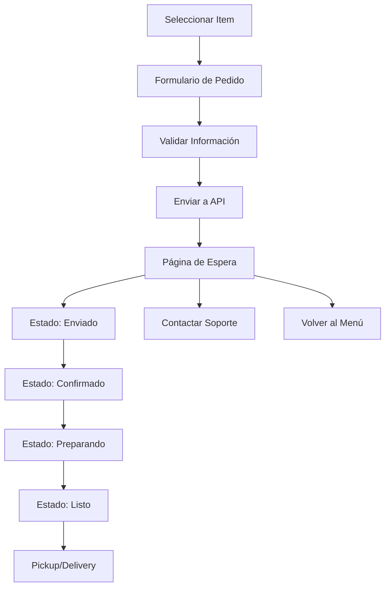

# 🍽️ Wendy Cocina Gourmet

Una aplicación web moderna y accesible para pedidos de comida casera en El Seibo, República Dominicana. Diseñada especialmente para personas mayores con una interfaz amigable y fácil de usar.

## 📋 Tabla de Contenidos

- [Características](#-características)
- [Tecnologías](#-tecnologías)
- [Instalación](#-instalación)
- [Uso](#-uso)
- [Estructura del Proyecto](#-estructura-del-proyecto)
- [API](#-api)
- [Componentes](#-componentes)
- [Flujo de Pedidos](#-flujo-de-pedidos)
- [Accesibilidad](#-accesibilidad)
- [Contribuir](#-contribuir)
- [Licencia](#-licencia)

## ✨ Características

### 🎯 Diseño Centrado en el Usuario
- **Interfaz amigable para personas mayores** con fuentes grandes y botones táctiles
- **Colores de alto contraste** para mejor visibilidad
- **Navegación simplificada** con iconos claros y descriptivos
- **Controles de fuente** ajustables (pequeña, normal, grande)

### 🛒 Sistema de Pedidos Completo
- **Menú diario** con especiales del día
- **Formulario de pedido detallado** con información del cliente
- **Seguimiento en tiempo real** del estado del pedido
- **Opciones de servicio**: Recogida en local o delivery a domicilio
- **Historial de pedidos** para reordenar fácilmente

### 📱 Funcionalidades Modernas
- **Progressive Web App (PWA)** - Instalable en dispositivos móviles
- **Modo offline** con indicador de conectividad
- **Integración con WhatsApp** para soporte al cliente
- **Responsive design** - Funciona en todos los dispositivos

### 🚀 Rendimiento y Accesibilidad
- **Optimizado para velocidad** con Next.js 14
- **Accesible** siguiendo estándares WCAG
- **SEO optimizado** para búsquedas locales
- **Soporte offline** básico

## 🛠️ Tecnologías

- **Framework**: [Next.js 14](https://nextjs.org/) con App Router
- **Lenguaje**: [TypeScript](https://www.typescriptlang.org/)
- **Estilos**: [Tailwind CSS](https://tailwindcss.com/)
- **Iconos**: Emojis nativos para mejor compatibilidad
- **PWA**: Service Worker integrado
- **API**: Next.js API Routes

## 🚀 Instalación

### Prerrequisitos
- Node.js 18.0 o superior
- npm o yarn

### Pasos de Instalación

1. **Clonar el repositorio**
```bash
git clone https://github.com/tu-usuario/comida-casera-el-seibo.git
cd comida-casera-el-seibo
```

2. **Instalar dependencias**
```bash
npm install
```

3. **Configurar variables de entorno** (opcional)
```bash
cp .env.example .env.local
```

4. **Ejecutar en modo desarrollo**
```bash
npm run dev
```

5. **Abrir en el navegador**
```
http://localhost:3000
```

### Scripts Disponibles

```bash
# Desarrollo
npm run dev

# Construcción para producción
npm run build

# Iniciar servidor de producción
npm start

# Linting
npm run lint
```

## 📖 Uso

### Para Clientes

1. **Navegar al menú** - Ver los especiales del día
2. **Seleccionar un plato** - Hacer clic en "Hacer Pedido"
3. **Completar el formulario** - Llenar información personal y preferencias
4. **Confirmar pedido** - Revisar detalles y enviar
5. **Seguir el progreso** - Ver actualizaciones en tiempo real
6. **Contactar soporte** - Usar WhatsApp si es necesario

### Para Administradores

- Los pedidos se reciben a través de la API
- Se puede integrar con sistemas de gestión de pedidos
- WhatsApp como canal de soporte directo

## 📁 Estructura del Proyecto

```
comida-casera-el-seibo/
├── app/                          # App Router de Next.js
│   ├── api/                      # API Routes
│   │   └── orders/              # Endpoints de pedidos
│   ├── globals.css              # Estilos globales
│   ├── layout.tsx               # Layout principal
│   └── page.tsx                 # Página principal
├── components/                   # Componentes React
│   ├── elderly/                 # Componentes específicos para personas mayores
│   ├── ui/                      # Componentes de UI reutilizables
│   ├── Header.tsx               # Encabezado con controles
│   ├── MenuSection.tsx          # Sección del menú
│   ├── OrderForm.tsx            # Formulario de pedidos
│   ├── OrderWaitingPage.tsx     # Página de seguimiento
│   ├── QuickOrder.tsx           # Pedidos rápidos
│   └── ...                      # Otros componentes
├── public/                       # Archivos estáticos
│   ├── icons/                   # Iconos de la PWA
│   └── manifest.json            # Manifiesto de la PWA
├── styles/                       # Estilos adicionales
├── package.json                 # Dependencias y scripts
├── tailwind.config.js           # Configuración de Tailwind
├── tsconfig.json               # Configuración de TypeScript
└── next.config.js              # Configuración de Next.js
```

## 🔌 API

### Endpoints Disponibles

#### `POST /api/orders`
Crear un nuevo pedido

**Request Body:**
```json
{
  "item": {
    "id": 1,
    "name": "Pollo Guisado",
    "price": 350,
    "emoji": "🍗"
  },
  "quantity": 2,
  "serviceType": "pickup",
  "customerInfo": {
    "name": "María González",
    "phone": "809-123-4567",
    "email": "maria@email.com",
    "address": "Calle Principal #123"
  },
  "specialInstructions": "Sin sal",
  "total": 700
}
```

**Response:**
```json
{
  "success": true,
  "order": {
    "id": "ORD-1703123456789-ABC123DEF",
    "status": "submitted",
    "createdAt": "2023-12-21T10:30:00.000Z",
    "estimatedTime": 30
  },
  "message": "Pedido recibido exitosamente"
}
```

#### `GET /api/orders?id={orderId}`
Obtener estado de un pedido

**Response:**
```json
{
  "success": true,
  "order": {
    "id": "ORD-1703123456789-ABC123DEF",
    "status": "preparing",
    "estimatedTime": 15,
    "createdAt": "2023-12-21T10:30:00.000Z"
  }
}
```

## 🧩 Componentes

### Componentes Principales

#### `MenuSection`
- Muestra los especiales del día
- Maneja disponibilidad y porciones
- Sección de favoritos basada en historial

#### `OrderForm`
- Formulario completo de pedidos
- Validación de campos requeridos
- Cálculo automático de precios
- Soporte para pickup y delivery

#### `OrderWaitingPage`
- Seguimiento en tiempo real
- Línea de tiempo visual del progreso
- Información completa del pedido
- Botón de contacto con soporte

#### `QuickOrder`
- Plantillas de pedidos populares
- Combos predefinidos
- Pedidos rápidos con un clic

### Componentes de UI

#### `FontControls`
- Control de tamaño de fuente
- Persistencia en localStorage
- Accesibilidad mejorada

#### `PWAInstallPrompt`
- Prompt de instalación de PWA
- Detección automática de compatibilidad

## 🔄 Flujo de Pedidos

### Flujo Completo



### Estados del Pedido

1. **Submitted** (📝) - Pedido enviado y recibido
2. **Confirmed** (✅) - Pedido confirmado por el restaurante
3. **Preparing** (👨‍🍳) - Chef preparando la comida
4. **Ready** (🍽️) - Pedido listo para pickup/delivery
5. **Completed** (🎉) - Pedido completado
6. **Cancelled** (❌) - Pedido cancelado

## ♿ Accesibilidad

### Características de Accesibilidad

- **Contraste de colores** cumple con WCAG AA
- **Tamaños de fuente** ajustables (20px - 52px)
- **Botones táctiles** mínimo 44px de altura
- **Navegación por teclado** completa
- **Lectores de pantalla** compatibles
- **Indicadores de foco** visibles
- **Reducción de movimiento** respetada

### Fuentes Personalizadas para Personas Mayores

```css
/* Tamaños de fuente específicos */
.text-elderly-sm { font-size: 20px; }
.text-elderly-base { font-size: 24px; }
.text-elderly-lg { font-size: 28px; }
.text-elderly-xl { font-size: 32px; }
.text-elderly-2xl { font-size: 40px; }
.text-elderly-3xl { font-size: 52px; }
```

## 🌐 PWA (Progressive Web App)

### Características PWA

- **Instalable** en dispositivos móviles y desktop
- **Funciona offline** con cache básico
- **Iconos adaptativos** para diferentes plataformas
- **Splash screen** personalizada
- **Actualizaciones automáticas**

### Instalación

Los usuarios pueden instalar la app:
1. **Android**: "Agregar a pantalla de inicio"
2. **iOS**: "Agregar a pantalla de inicio" desde Safari
3. **Desktop**: Botón de instalación en la barra de direcciones

## 🔧 Configuración

### Tailwind CSS

Configuración personalizada para personas mayores:

```javascript
// tailwind.config.js
module.exports = {
  theme: {
    extend: {
      fontSize: {
        'elderly-sm': '20px',
        'elderly-base': '24px',
        'elderly-lg': '28px',
        'elderly-xl': '32px',
        'elderly-2xl': '40px',
        'elderly-3xl': '52px',
      },
      colors: {
        'primary-green': '#059669',
        'elderly-bg': '#f8fafc',
      },
      spacing: {
        'touch': '56px',
        'comfortable': '28px',
      }
    }
  }
}
```

### Next.js

```javascript
// next.config.js
const nextConfig = {
  experimental: {
    appDir: true,
  },
  images: {
    domains: ['localhost'],
  },
}
```

## 🚀 Despliegue

### Vercel (Recomendado)

1. **Conectar repositorio** a Vercel
2. **Configurar variables de entorno** si es necesario
3. **Desplegar automáticamente** con cada push

### Otros Proveedores

- **Netlify**: Compatible con build estático
- **Railway**: Para aplicaciones full-stack
- **DigitalOcean**: App Platform

### Variables de Entorno

```bash
# .env.local
NEXT_PUBLIC_WHATSAPP_NUMBER=8293450059
NEXT_PUBLIC_BUSINESS_NAME="Comida Casera El Seibo"
```

## 🧪 Testing

### Pruebas Recomendadas

```bash
# Instalar dependencias de testing
npm install --save-dev @testing-library/react @testing-library/jest-dom jest

# Ejecutar pruebas
npm test
```

### Áreas de Testing

- Formulario de pedidos
- Validación de datos
- Flujo de estados
- Componentes de UI
- Accesibilidad

## 📱 Soporte de Dispositivos

### Navegadores Soportados

- **Chrome** 90+
- **Firefox** 88+
- **Safari** 14+
- **Edge** 90+

### Dispositivos

- **Móviles**: iOS 12+, Android 8+
- **Tablets**: iPad, Android tablets
- **Desktop**: Windows, macOS, Linux

## 🤝 Contribuir

### Cómo Contribuir

1. **Fork** el repositorio
2. **Crear rama** para tu feature (`git checkout -b feature/nueva-funcionalidad`)
3. **Commit** tus cambios (`git commit -m 'Agregar nueva funcionalidad'`)
4. **Push** a la rama (`git push origin feature/nueva-funcionalidad`)
5. **Crear Pull Request**

### Estándares de Código

- **TypeScript** estricto
- **ESLint** configurado
- **Prettier** para formateo
- **Conventional Commits**

### Reportar Bugs

Usar GitHub Issues con:
- Descripción clara del problema
- Pasos para reproducir
- Screenshots si es visual
- Información del navegador/dispositivo

## 📞 Soporte

### Contacto

- **WhatsApp**: +1 (809) 456-7890
- **Email**: soporte@comidacaseraseibo.com
- **Ubicación**: El Seibo, República Dominicana

### FAQ

**¿Cómo cambio el tamaño de la fuente?**
Usa el botón "Aa" en la esquina superior derecha.

**¿Puedo cancelar mi pedido?**
Sí, contacta por WhatsApp antes de que esté "Preparando".

**¿Hay costo de delivery?**
Sí, RD$ 50 dentro de El Seibo.

## 📄 Licencia

Este proyecto está bajo la Licencia MIT. Ver el archivo [LICENSE](LICENSE) para más detalles.

---

## 🙏 Agradecimientos

- **Comunidad de El Seibo** por su apoyo
- **Personas mayores** que inspiraron el diseño
- **Desarrolladores** que contribuyeron al proyecto

---

**Hecho con ❤️ para la comunidad de El Seibo, República Dominicana**

*¿Tienes hambre? ¡Haz tu pedido ahora! 🍽️* 